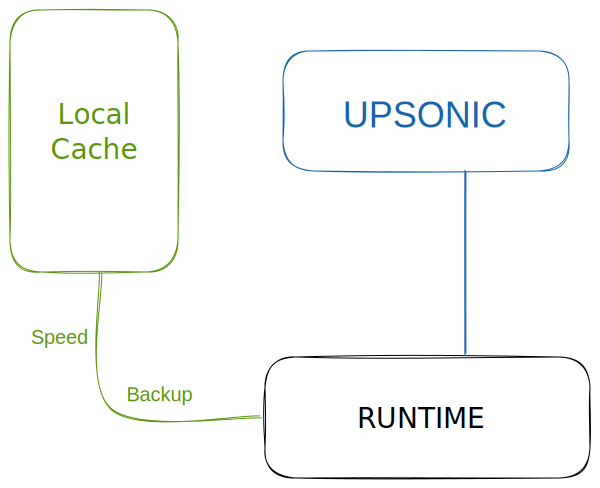

# Caching: Backup for Your Systems - New

## Introduction

Upsonic Cloud have an caching option with this you can prevent any network based problems for gathering your functions, classes and etc. Also you can reduce your network traffic via cache first and check update way.





## Enabling

You can enable the caching via  `cache` but also you should set an `cache_counter` for setting the update control time for each key. If you set 5 for cache counter the system will count to 5 for each key get call and after the 5 its will check for update for the key. If there is an suitable update the system will download and replace cache automaticaly.


Caches are stored in `upsonic_cache` folder in your workdir. You should store this folder for emergency situations.



```python
from upsonic import Upsonic_Cloud_Free

cloud = Upsonic_Cloud_Free(cache=True, cache_counter=100)
```



```
cache = True
cache_counter = 100
```




## Result

When you use the caching you will have a backup for your systems and the systems will work with no delay.
